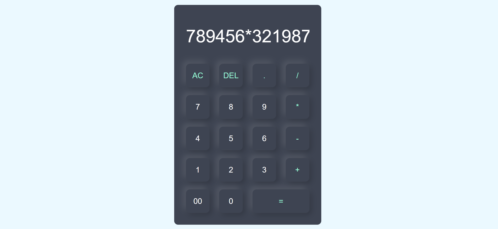

# 🧮 Calculator

A simple and responsive calculator built using **HTML, CSS, and JavaScript** as part of my **CodeAlpha Frontend Development Internship**.

## 🚀 Features

- Basic arithmetic operations
- Addition, subtraction, multiplication, and division
- Clear button to reset the calculation
- Responsive and user-friendly interface
- Interactive buttons
- Clean and modern design

## 🛠️ Technologies Used

- HTML5
- CSS3
- JavaScript
- Font Awesome

## 📂 Project Structure

https://github.com/zaeemdanish007-hub/CodeAlpha_Calculator

CodeAlpha_Calculator/
│
├── index.html
├── style.css
├── script.js
├── README.md
└── images/

💻 How to Run
Clone this repository:
git clone https://github.com/zaeemdanish007-hub/CodeAlpha_Calculator
Open the project folder.
Open index.html in your web browser.

🎯 Internship Task

This project was created as part of Task 2 — Calculator for my CodeAlpha Frontend Development Internship.

👨‍💻 Author

Zaeem Danish

GitHub: https://github.com/zaeemdanish007-hub
LinkedIn: https://www.linkedin.com/in/zaeem-danish-920a01372/

## 📸 Preview

⭐ If you like this project, feel free to give it a star!
